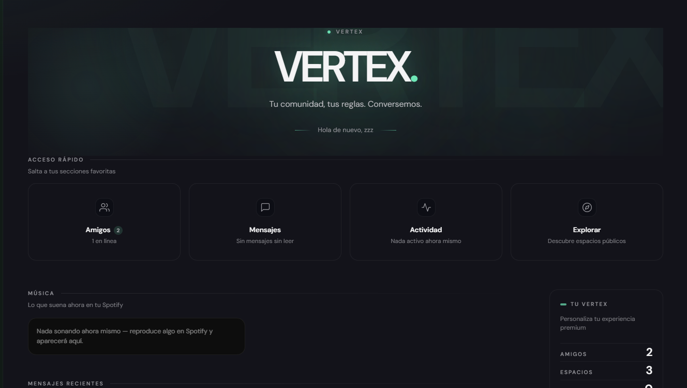
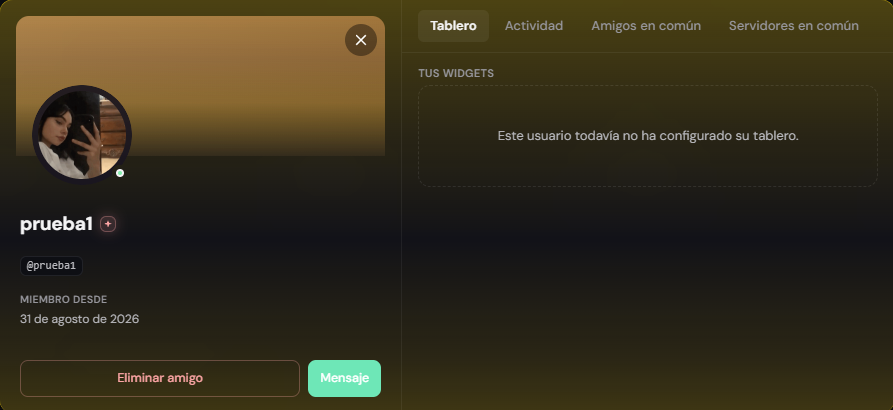
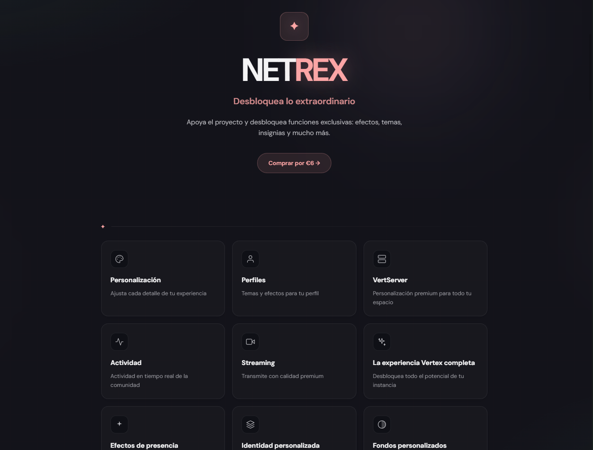
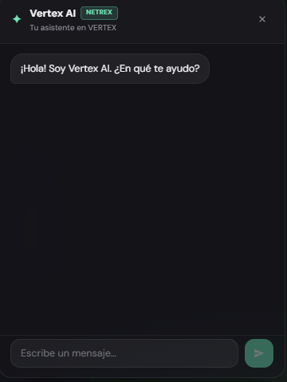

<div align="center">


# VERTEX

### **Tu comunidad, tus reglas.**

[](LICENSE)
[](https://www.typescriptlang.org/)
[](https://nodejs.org/)

</div>

---

**VERTEX** es una plataforma de comunicación self-hosted que ejecutas en tu propio
hardware: espacios, canales de texto, voz y video, compartición de pantalla, mensajes
directos, amigos y federación entre instancias. Tú eres el dueño del servidor, de los
datos y de las reglas — nadie más.

## Capturas

<div align="center">



<sub><em>La home de VERTEX: acceso rápido, música de Spotify y tus mensajes recientes.</em></sub>

</div>

<table>
  <tr>
    <td width="50%" valign="top">
      <br/>
      <sub><b>Perfiles con tablero.</b> Banner, bio y widgets personales.</sub>
    </td>
    <td width="50%" valign="top">
      <br/>
      <sub><b>Netrex.</b> La capa premium gestionada por tu instancia.</sub>
    </td>
  </tr>
  <tr>
    <td width="50%" valign="top">
      <br/>
      <sub><b>Vertex AI.</b> Tu asistente integrado, con tiering Netrex.</sub>
    </td>
    <td width="50%" valign="top">
      <!-- matchcard pendiente: añadir docs/matchcard.png cuando esté disponible -->
      <em>Match Cards — captura en camino.</em>
    </td>
  </tr>
</table>

## Features

- **Netrex** — la capa premium integrada, gestionada por el admin de tu instancia:
  efectos de perfil premium, personalización extendida y prioridad de features. Sin
  servicios de facturación externos: el dueño de la instancia controla todo.
- **Vertex AI** — asistente con IA integrada en el chat y en el portal web, con tiering
  para miembros de Netrex. Configuras tu propia API key en tu instancia y listo.
- **Spotify** — actividad musical en vivo: lo que escuchas aparece en tu perfil y en las
  tarjetas de actividad, con embeds de Spotify en el chat.
- **Match Cards** — descubrimiento social con tarjetas: gustos musicales, estilos y
  afinidades entre miembros de tu comunidad.
- **Voz y video de verdad** — hasta 4K/120fps en screen share, VP9 o H.264 por hardware,
  volumen independiente 0-200% por persona y por stream, supresión de ruido RNNoise e
  inspector de conexión en vivo.
- **Personalización total** — temas, colores de acento, banners, bios, efectos de perfil
  y un tablero de perfil (board) con widgets tuyos.
- **Federación** — conecta tu instancia con otras para amigos, DMs y llamadas entre
  servidores, sin walled gardens. Cada instancia sigue siendo independiente.
- **Desktop app** — Electron para Windows, macOS y Linux, con keybinds globales
  (push-to-talk, mute, deafen) y detección de actividad.

## Download

**[⬇ Descargar VERTEX v1.0.2 para Windows](https://github.com/Gtnnn12/vertex/releases/latest)** —
instalador asistido, conecta a la instancia oficial al instalar. Las versiones para macOS y Linux
llegarán en próximas fases; todos los lanzamientos quedan en
**[GitHub Releases](https://github.com/Gtnnn12/vertex/releases)**.

Mientras tanto, puedes construirlo tú mismo:

```bash
git clone https://github.com/Gtnnn12/vertex.git
cd vertex
pnpm install
cp .env.example .env    # pon tu JWT_SECRET (openssl rand -hex 32)
pnpm dev
```

## Created by Gtnn

Hecho a mano — diseño, código y mascota incluidos.

© 2026 Gtnnn12 · [LICENSE](LICENSE) (MIT — ver [NOTICE](NOTICE) para las partes heredadas bajo AGPL-3.0)
